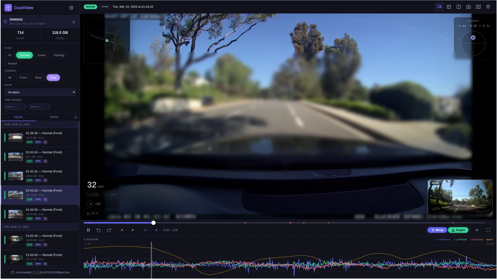
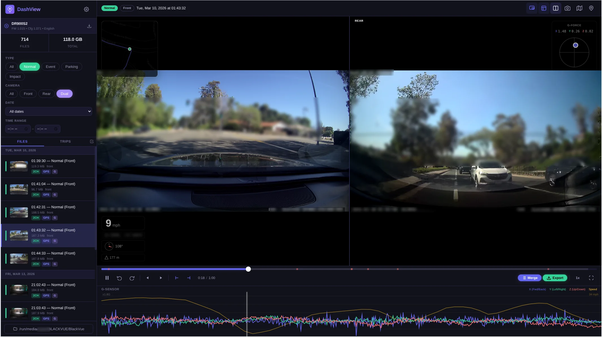
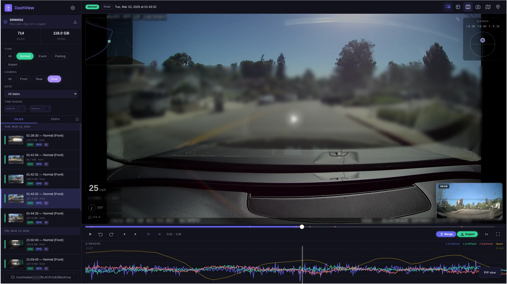
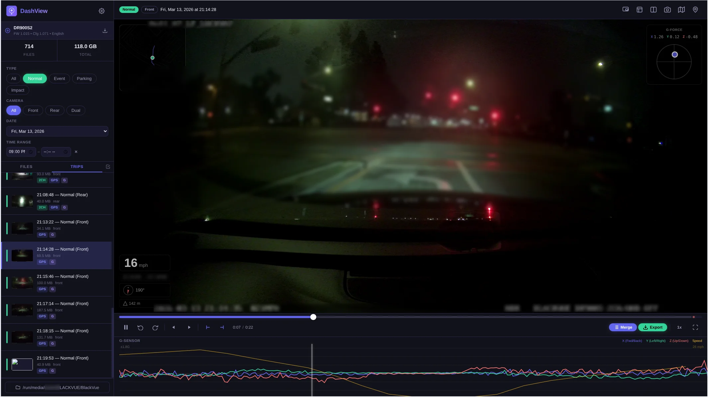
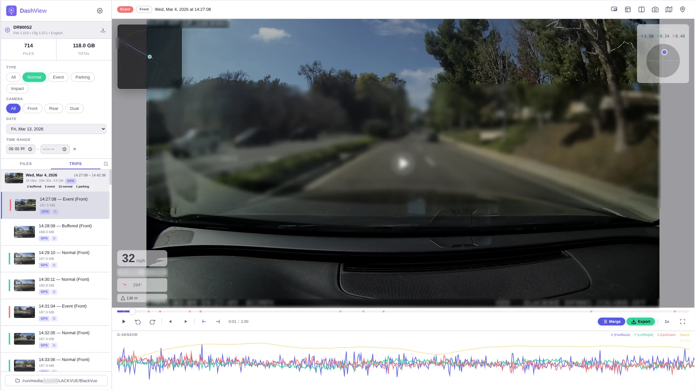
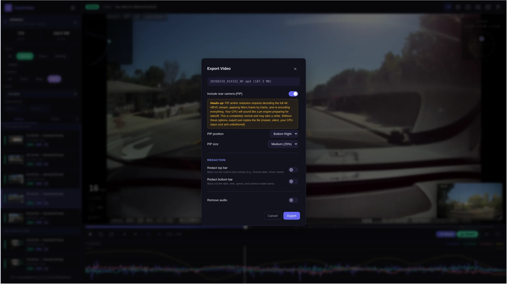
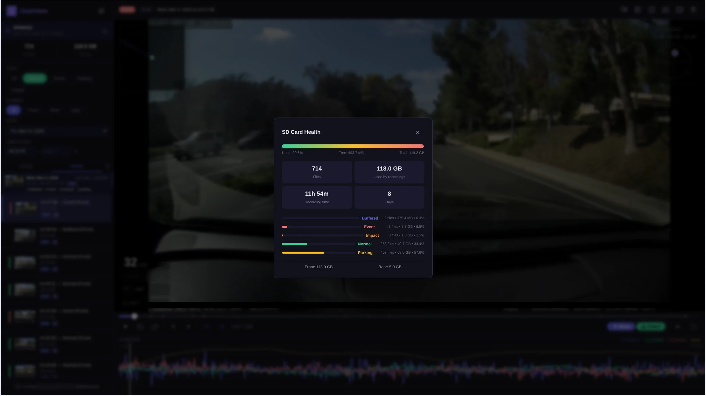
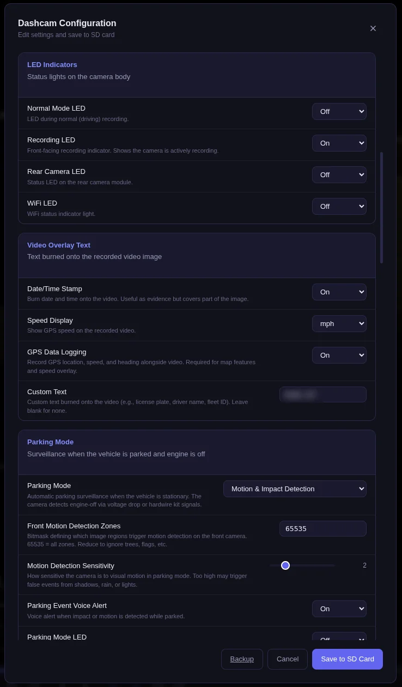
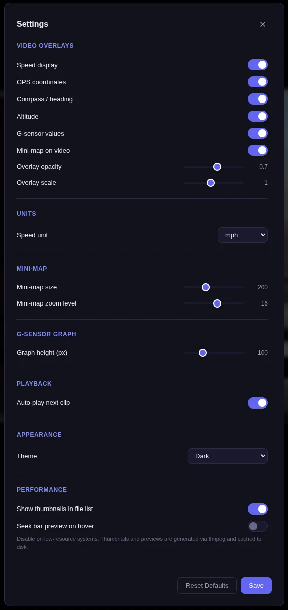
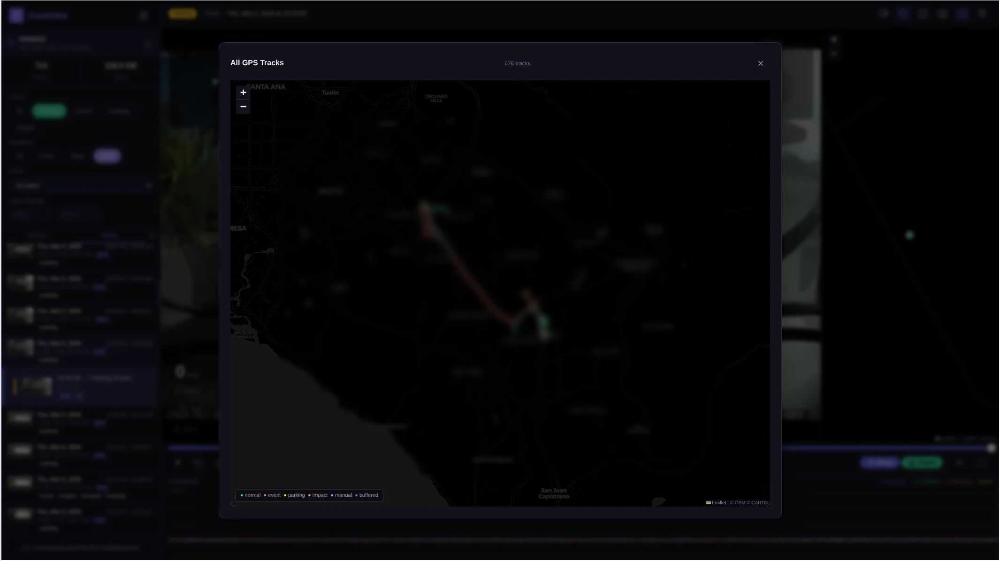

# DashView

A modern, web-based dashcam viewer for BlackVue dashcams on Linux. View, analyze, and manage your recordings with a sleek dark UI, GPS/G-sensor overlays synced to video playback, trip detection, video export with PiP and redaction, and a full dashcam configuration editor.


> **Note:** This software has been developed and tested primarily with the **BlackVue DR900S-2CH** dashcam. It should work with other BlackVue models that use the same file format (DR900X, DR770X, DR750X, etc.), but compatibility is not guaranteed. Contributions and testing reports for other models are welcome.

## Screenshots

**Video playback with PiP, speed overlay, and G-sensor graph:**



**Dual view (front + rear side-by-side):**



**G-sensor graph, PiP, and speed overlay:**



**Night vision recording:**



**Light theme:**



**Export dialog with PiP, redaction, and trim options:**



**SD Card Health dashboard:**



**Dashcam configuration editor:**



**Settings panel:**



**All GPS tracks map:**



## Features

### Video Playback
- Modern dark-themed UI with light theme and auto (system) theme support
- Custom video controls with keyboard shortcuts
- Adjustable playback speed (0.5x, 1x, 1.5x, 2x, 4x)
- Frame-by-frame stepping (`,` and `.` keys or buttons)
- Automatic playback of next clip in sequence (skips rear files when PiP/dual is active)
- Fullscreen mode
- Seek bar thumbnail preview on hover (cached sprite strips)

### Rear Camera Picture-in-Picture (PiP)
- Automatically shows the matching rear camera feed when available
- Draggable and resizable PiP window (maintains 16:9 aspect ratio)
- Time-synced with the main video
- Auto-enables when a rear file exists, respects user toggle
- Filter to show only clips with both front and rear recordings ("Dual" filter)
- **Dual view mode** (press `D`) — side-by-side 50/50 split instead of floating PiP

### GPS Overlay (time-synced to video)
- Live speed display (km/h, mph, knots, or m/s)
- GPS coordinates overlay
- Compass/heading indicator with rotating needle
- Altitude display
- Mini-map on the video showing current position and route
- Side-panel map with full route visualization
- Dark-themed map tiles (CartoDB) with English labels
- Extracts GPS from BlackVue's embedded MP4 `gps` atom (NMEA format)

### G-Sensor Overlay (time-synced to video)
- Real-time X/Y/Z acceleration values on the video
- G-force direction dial (visual indicator)
- Timeline graph at the bottom with playback cursor synced to video
- Auto-centered baseline (median subtraction removes gravity bias)
- Auto-scaled to show detail (adapts range to actual forces in the clip)
- **Speed graph** overlaid in yellow when GPS data is available
- **Hover tooltip** — move mouse over graph to see exact G-force, speed, and timestamp
- **Click to seek** — click anywhere on the graph to jump to that moment
- **Event markers** — red dots on the seek bar marking G-sensor spikes (impacts, hard braking)
  - Click a marker to jump to that event
  - Uses statistical peak detection (mean + 2.5 standard deviations)

### Screenshot
- Press `S` or click the camera icon to capture a full-resolution PNG
- Includes PiP overlay if visible
- Auto-named with filename and timestamp

### Clip Trimming
- Set in-point (`I` key) and out-point (`O` key) on the video timeline
- Visual purple highlight on the progress bar showing the trim region
- Trim duration display in the controls
- Export only the trimmed portion (stream copy = instant, or with PiP/redaction)
- Combine with all export options

### Video Export
- **Export button** (green) in the player controls
- Export options:
  - Include rear camera as PiP overlay (configurable position and size)
  - Remove audio
  - **Redact top bar** (custom text overlay like license plate)
  - **Redact bottom bar** (date, time, speed, camera model stamp)
  - Configurable redaction bar height
  - Trim to in/out points
- Stream copy for simple exports (instant, no quality loss)
- Re-encodes with libx264 when PiP or redaction is needed
- Warning about CPU usage for re-encoding exports

### Multi-Clip Merge
- **Merge button** (purple) in the player controls
- Select multiple clips with checkboxes, merge into one continuous video
- Auto-selects the current trip's clips
- Select All / Clear buttons
- Stream copy merge (fast, no re-encoding)
- **Trip merge** — one-click merge button on each trip card in the Trips view

### Batch Export
- Checkbox toggle (☑) next to Files/Trips tabs to enter batch mode
- Select multiple files with checkboxes
- Select All / Clear buttons
- Exports as a ZIP archive

### Trip Detection
- **Trips tab** in the sidebar groups clips into trips based on 5-minute time gaps
- Each trip shows: thumbnail, date, time range, clip count, duration, total size, category badges
- Expandable — click a trip to see all its clips inline with thumbnails
- Play clips without leaving the trips view
- **One-click merge** button appears on hover for trips with 2+ clips

### All GPS Tracks Map
- Pin icon button opens a near-fullscreen map showing every GPS track on the SD card
- Color-coded by recording type (green=normal, red=event, yellow=parking, orange=impact)
- Click any track to see date, time, and filename
- **Background cache building** — starts automatically when a folder is opened
- Live progress display when cache is building
- Cached to disk for instant loading on subsequent opens

### SD Card Health Dashboard
- Click the Files/Total stats in the sidebar to open
- **Storage usage bar** with percentage
- Overview: total files, size, recording hours, days
- **Category breakdown** with visual bars and percentages
- Front vs rear camera storage split

### Dashcam Configuration Editor
- Read and edit the dashcam's `config.ini` directly from the SD card
- **12 logical sections**: Video & Image, Recording, Parking Mode, G-Sensor & Events, Video Overlay Text, Speed Alerts, Date & Time, LED Indicators, Voice Announcements, System, WiFi Hotspot, Cloud & Remote Access
- Detailed description for every setting
- Automatic backup before saving
- Download config backup
- Dashcam model and firmware info display (from `version.bin`)

### File Management
- Smart detection of BlackVue file naming conventions
- Filter by recording type: Normal, Event, Parking, Impact, Buffered
- Filter by camera: All, Front, Rear, Dual (both cameras available)
- Filter by date and **time range** (from/to time pickers)
- **2CH badge** on files that have a matching rear camera recording
- GPS and G-sensor availability badges
- **Thumbnails** in file list (configurable, cached to disk)
- Chronological ordering (oldest to newest)
- Folder path history with quick-switch
- All filters persist across page refreshes

### Settings
- Configurable overlay toggles (speed, coordinates, heading, altitude, G-sensor, mini-map)
- Overlay opacity and scale
- Speed unit selection (km/h, mph, knots, m/s)
- Mini-map size and zoom
- G-sensor graph height
- Auto-play next clip toggle
- **Theme**: Auto (follows system), Dark, or Light
- Show/hide thumbnails in file list
- Show/hide seek bar preview
- All settings persist to `~/.config/dashview/settings.json`

### Keyboard Shortcuts

Press `?` to show the shortcuts overlay.

| Key | Action |
|-----|--------|
| `Space` | Play / Pause |
| `←` | Skip back 10s |
| `Shift+←` | Skip back 30s |
| `→` | Skip forward 10s |
| `Shift+→` | Skip forward 30s |
| `,` | Frame back |
| `.` | Frame forward |
| `I` | Set trim in-point |
| `O` | Set trim out-point |
| `↑` | Previous file |
| `↓` | Next file |
| `F` | Toggle fullscreen |
| `M` | Toggle side-panel map |
| `O` | Toggle all overlays |
| `P` | Toggle rear camera PiP |
| `D` | Toggle dual view (side-by-side) |
| `S` | Screenshot |
| `?` | Keyboard shortcuts help |

## Requirements

- **Python 3.8+**
- **Flask** (installed automatically)
- **ffmpeg** (for export, thumbnails, and seek bar previews)
  - `ffmpeg-free` works for basic exports
  - Full `ffmpeg` with HEVC decoder needed for PiP export with H.265 videos
- A modern web browser (Chrome, Firefox, Edge)
- Linux (tested on AlmaLinux 10, should work on any distribution)

## Quick Start

No installation required for basic usage:

```bash
cd dashcam-viewer
pip install -r requirements.txt
python3 dashcam_viewer.py -d /path/to/dashcam/sd/card --open
```

The `-d` flag points to the root of your dashcam's SD card (the folder containing `Record/` and `Config/` directories). The `--open` flag automatically opens your browser.

## Installation (System-Wide)

The install script supports multiple Linux distributions:

```bash
sudo ./install.sh
```

### Supported Distributions

| Distribution | Package Manager |
|---|---|
| AlmaLinux, Rocky, CentOS, Fedora, RHEL | `dnf` / `yum` |
| Debian, Ubuntu, Mint, Pop!_OS, Kali, Raspbian | `apt-get` |
| Arch, Manjaro, EndeavourOS, Garuda | `pacman` |
| openSUSE, SLES | `zypper` |
| Void Linux | `xbps-install` |
| Alpine Linux | `apk` |
| Gentoo | `emerge` |

After installation:

```bash
# Run from command line
dashview -d /path/to/dashcam/files --open

# Or launch from your application menu (DashView)
```

### Uninstall

```bash
sudo ./uninstall.sh
```

## Usage

```
dashview [options]

Options:
  -d, --directory PATH   Path to dashcam recordings folder
  -p, --port PORT        Port to listen on (default: 5000)
  -H, --host HOST        Host to bind to (default: 127.0.0.1)
  --open                 Open browser automatically
```

### SD Card Structure

DashView expects the standard BlackVue SD card layout:

```
/path/to/sd/card/
├── Config/
│   ├── config.ini      # Dashcam configuration
│   └── version.bin     # Firmware/model info
├── Record/
│   ├── 20260304_142910_NF.mp4   # Normal, Front
│   ├── 20260304_142910_NR.mp4   # Normal, Rear
│   ├── 20260304_143104_EF.mp4   # Event, Front
│   ├── 20260304_144238_PF.mp4   # Parking, Front
│   └── ...
└── System/
```

### File Naming Convention

BlackVue files follow the pattern `YYYYMMDD_HHMMSS_TT.mp4`:

| Code | Type |
|------|------|
| `NF` / `NR` | Normal recording (Front / Rear) |
| `EF` / `ER` | Event recording — G-sensor triggered |
| `PF` / `PR` | Parking mode recording |
| `IF` / `IR` | Impact recording |
| `BF` / `BR` | Buffered recording (pre-event) |
| `MF` / `MR` | Manual recording |
| `TF` / `TR` | Timelapse recording |

### Embedded Data Formats

BlackVue cameras embed GPS and G-sensor data directly in the MP4 files (no separate files needed):

**GPS** (`gps` atom in MP4): NMEA sentences with millisecond timestamps
```
[1646250903830]$GPRMC,180500.000,A,3356.5470,N,11823.9647,W,045.2,182.3,040326,,,D*70
[1646250903830]$GPGGA,180500.000,3356.5470,N,11823.9647,W,1,09,0.9,38.0,M,-32.6,M,,0000*5A
```

**G-Sensor** (`3gf` atom in MP4): Binary, 10 bytes per record (big-endian)
| Offset | Type | Description |
|--------|------|-------------|
| 0 | `uint32` | Timestamp (ms) |
| 4 | `int16` | X-axis (forward/backward) |
| 6 | `int16` | Y-axis (left/right) |
| 8 | `int16` | Z-axis (up/down) |

Scale: ~100 raw units = 1G. Records every 100ms (10 Hz).

## Data & Cache

DashView stores its data in standard Linux locations:

| Path | Contents |
|------|----------|
| `~/.config/dashview/settings.json` | App settings, folder path, folder history |
| `~/.cache/dashview/thumbs/` | Video thumbnails (generated on first view) |
| `~/.cache/dashview/previews/` | Seek bar preview strips |
| `~/.cache/dashview/tracks.json` | GPS tracks cache for the all-tracks map |

Filter state (type, camera, date, time range) is stored in browser `localStorage`.

All caches are keyed by filename + modification time, so they auto-invalidate when files change.

## Configuration

### Application Settings

DashView stores its settings in `~/.config/dashview/settings.json`. These can be changed from the Settings panel (gear icon) in the UI. Settings include:

- Video overlays (speed, coordinates, heading, altitude, G-sensor, mini-map)
- Overlay opacity and scale
- Speed unit (km/h, mph, knots, m/s)
- Mini-map size and zoom level
- G-sensor graph height
- Theme (auto/dark/light)
- Thumbnail and preview toggles
- Auto-play next clip

### Dashcam Configuration

The dashcam configuration editor reads and writes `Config/config.ini` on the SD card. After saving changes:

1. Safely eject the SD card from your computer
2. Insert it into the dashcam
3. The dashcam will apply the new settings on next boot

**A backup (`config.ini.bak`) is automatically created before each save.**

## Tested Hardware

| Model | Status | Notes |
|-------|--------|-------|
| BlackVue DR900S-2CH | Tested | Primary development/test device |
| Other BlackVue models | Untested | Should work if using same file/config format |

If you test with a different model, please open an issue or PR with your findings.

## Contributing

Contributions are welcome! Areas where help is especially needed:

- Testing with other BlackVue models (DR900X, DR770X, DR750X, DR590X, etc.)
- Testing with non-BlackVue dashcams that use similar formats
- Additional export formats (GIF, WebM)
- Video clip concatenation improvements
- Mobile UI polish
- Localization / i18n

### Development

```bash
# Clone the repo
git clone https://github.com/YOUR_USERNAME/dashview.git
cd dashview

# Install dependencies
pip install -r requirements.txt

# Run in development
python3 dashcam_viewer.py -d /path/to/test/data --open
```

## License

This project is licensed under the MIT License. See [LICENSE](LICENSE) for details.

## Acknowledgments

- [Flask](https://flask.palletsprojects.com/) — Web framework
- [Leaflet](https://leafletjs.com/) — Map library
- [CartoDB](https://carto.com/) — Dark map tiles
- [OpenStreetMap](https://www.openstreetmap.org/) — Map data
- [ffmpeg](https://ffmpeg.org/) — Video processing
